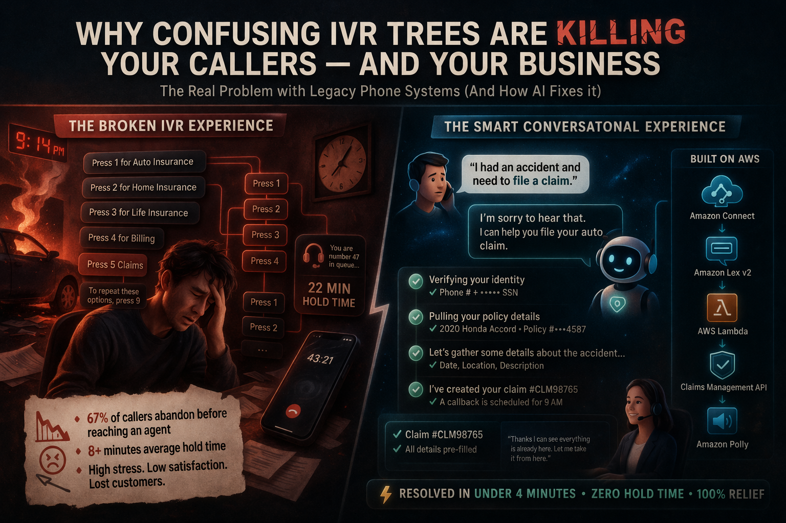

> A practitioner's guide to replacing legacy IVR with AWS Connect, Amazon Lex, and GenAI — with real-world examples, architecture diagrams, and hard-won lessons from the field.

---

## 👤 Author

**Yogesh Soppa**  
Product Engineer · Conversational AI · AWS Solutions Architect  

📅 March 29, 2026  

---

It's 9:14 PM. You've just been in a car accident. You call your insurance company — hands shaking, car still steaming — and you hear it:

> "Press 1 for auto insurance. Press 2 for home insurance. Press 3 for life insurance. Press 4 for billing. Press 5 for claims. To repeat these options, press 9."

— Every legacy IVR system, every insurance company, since 1998

---


---

You press 5. Then wait. Then get transferred. Then wait again. Forty-three minutes later, you've spoken to three agents and still haven't filed the claim. You've also decided, quietly, that you're switching insurers.

This isn't a UX problem. It's a **technology debt problem** — and it has a real, deployable solution that's available right now, in 2026. I've spent the last 12 years building these solutions at scale, most recently migrating a major insurance carrier's legacy Avaya IVR to Amazon Connect. Here's everything I know.

---


---

- **67%** of callers hang up during IVR before reaching an agent  
- **8 min** average hold time in insurance contact centers  
- **25%** containment rate improvement with AI chatbots  
- **20%** reduction in call-handling time  

---

## The Real Problem: Legacy IVR Was Built for Phones, Not People

The Interactive Voice Response systems most banks and insurers run today were designed in the early 2000s — or even the late 1990s. They were built on on-premise hardware (Avaya, Genesys, Cisco) with a simple premise: route calls based on keypad input, reduce agent load, cut costs.

It worked, for a while. But caller expectations have changed dramatically.

---

## Legacy IVR vs Modern AI

| Feature | Legacy IVR (Avaya / Genesys) | Modern AI (AWS Connect + Lex) |
|--------|------------------------------|-------------------------------|
| Input method | Keypad (DTMF tones) | Natural speech + NLU |
| Understanding | Keyword matching only | Intent + entity extraction |
| Self-service rate | 15–25% containment | 40–65% containment |
| Deployment time | 6–18 months | 6–12 weeks |
| Integration | Rigid | REST APIs |
| Analytics | Basic logs | Sentiment |
| Cost model | CapEx | OpEx |
| Scalability | Fixed | Auto-scale |

---

## Real-World Scenario 1: Insurance Claims



**With legacy IVR:**  
Caller navigates multiple menus, waits on hold, answers repeated questions. Total time: 45 minutes.

**With AWS Connect + Lex + Lambda:**  
Caller says "I had an accident."  
System detects intent, authenticates, collects data, and creates claim.

👉 Completed in under 4 minutes.

---

## Architecture


 Caller → Amazon Connect → Amazon Lex v2 → AWS Lambda → Claims API

 
---

## Real-World Scenario 2: Banking


**With legacy IVR:**  
Customer navigates menus and waits 18 minutes.

**With GenAI-powered chatbot:**  
Customer says "My card was declined."  
System checks API, identifies issue, resolves instantly.

👉 Resolved in 90 seconds.

---

## The Technical Stack That Actually Works (In 2026)

### Layer 1 — Telephony & Routing
Amazon Connect handles routing, queuing, and analytics.

### Layer 2 — NLP
Amazon Lex v2 + Amazon Bedrock

### Layer 3 — Business Logic
AWS Lambda integrates APIs.

### Layer 4 — Analytics
CloudWatch + Contact Lens

---

## Example: Lex Intent

```json
{
  "name": "FileClaim",
  "sampleUtterances": [
    "I had an accident",
    "I want to file a claim",
    "My car was hit"
  ],
  "slots": [
    { "name": "AccidentDate", "slotType": "AMAZON.Date" },
    { "name": "AccidentLocation", "slotType": "AMAZON.City" }
  ]
}

# The Migration Playbook: Legacy IVR → Amazon Connect

Based on our Avaya → Connect migration at Allstate India, here is the phased approach I recommend:

## 1. Audit & Map (Weeks 1–3)

Document every call flow in your existing IVR.  
Record actual call audio.  
Identify the top 20 call reasons — these are your first automation targets.  
In most insurance companies, 4 intents cover 60% of call volume: policy inquiry, billing, claims FNOL, and agent lookup.

## 2. Build the MVP on Connect (Weeks 4–8)

Set up Amazon Connect in your AWS account.  
Build the top 3 flows using the visual contact flow editor.  
Integrate Lex for the voicebot layer.  
Use Lambda to connect to one or two core APIs.  
Run in parallel with your legacy IVR — no cutover yet.

## 3. Shadow Traffic Testing (Weeks 9–11)

Route 5–10% of real calls to the new system while keeping agents on standby.  
Use Contact Lens transcripts to find edge cases.  
Retrain Lex intents based on actual customer language — this step doubled our intent accuracy.

## 4. Gradual Cutover (Weeks 12–16)

Ramp from 10% → 25% → 50% → 100% over 4 weeks.  
Have rollback ready at each step.  
Monitor containment rate, CSAT scores, and escalation rates daily.  
We achieved 20% CSAT improvement by week 14.

## 5. Decommission & Optimize (Week 17+)

Once Connect handles 100% of traffic and is stable, begin decommissioning legacy hardware.  
Shift budget from CapEx (hardware maintenance) to OpEx (pay-per-minute Connect pricing).  
Continue weekly intent retraining cycles.


